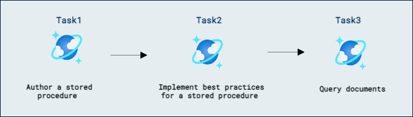

# Create a stored procedure with the Azure portal

## Lab scenario

Stored procedures are one of the ways you can execute business logic server-side in Azure Cosmos DB. With a stored procedure, you can perform basic CRUD (Create, Read, Update, Delete) operations with a container on multiple documents within a single transactional scope.

In this lab, you'll author a stored procedure that creates a document within your container. You will then use an SQL query to validate the results of the stored procedure.

## Lab objectives

In this lab, you will complete the following tasks:
- Task 1: Author a stored procedure.
- Task 2: Implement best practices for a stored procedure.
- Task 3: Query documents.

## Estimated Timing: 30 minutes

## Architecture Diagram



## Exercise 1: 

### Task 1: Author a stored procedure

Stored procedures are authored in language-integrated JavaScript and support the execution of basic CRUD operations inside of the database engine. JavaScript running within the database engine is made possible using the server-side JavaScript SDK for Azure Cosmos DB and a series of helper methods.

1. Inside the LabVM, double-click on the **Azure Portal** shortcut.

    

1. On the **Sign-in into Microsoft Azure** tab you will see the login screen, in that enter the following email/username and then click on **Next**. 
   * Email/Username: <inject key="AzureAdUserEmail"></inject>
   
     
     
1. Now enter the following password and click on **Sign in**.
   * Password: <inject key="AzureAdUserPassword"></inject>
   
     
     
        >**Note:** If you see the **Help us protect your account** dialog box, then select the **Skip for now** option.

        
  
1. If you see the pop-up **Stay Signed in?**, click No

1. If you see the pop-up **You have free Azure Advisor recommendations!**, close the window to continue the lab.

1. If a **Welcome to Microsoft Azure** popup window appears, click **Maybe Later** to skip the tour.

1. Select **+ Create a resource**, search for *Cosmos DB*, select **Azure Cosmos DB**.

1. Select **Create** under **Azure Cosmos DB for NoSQL**.

1. Within the **Create Azure Cosmos DB Account** pane, observe the **Basics** tab:

    | **Setting** | **Value** |
    | :--- | :--- |
    | **Subscription** | *Your existing Azure subscription* |
    | **Resource group** | **Cosmosdb-<inject key="DeploymentID" enableCopy="false"/>** |
    | **Account Name** | *Enter a globally unique name* |
    | **Location** | *Choose any available region* |
    | **Capacity mode** | *Provisioned throughput* |
    | **Apply Free Tier Discount** | *Do Not Apply* |

1. Click on **Review + create** and after validation get Success click on **Create**.

1. Wait for the deployment task to complete before continuing with this task.

1. Go to the newly created **Azure Cosmos DB** account resource and from the left navigation menu, navigate to the **Data Explorer** pane.

1. In the **Data Explorer**, select **New Container**, and then create a new container with the following settings, leaving all remaining settings to their default values, and select **OK**:

    | **Setting** | **Value** |
    | :--- | :--- |
    | **Database id** | *Create new* &vert; *cosmicworks* |
    | **Share throughput across containers** | *Select this option* |
    | **Database throughput** | *Manual* &vert; *4000* |
    | **Container id** | *products* |
    | **Indexing** | *Automatic* |
    | **Partition key** | */categoryId* |

1. Still within the **Data Explorer**, expand the **cosmicworks** database node, then select the new **products** container node within the **NOSQL API** navigation tree.

1. Select **New Stored Procedure**.

1. In the **Stored Procedure Id** field, enter the value **createDoc**.

1. Delete the contents of the editor area.

1. Create a new JavaScript function named **createDoc** with no input parameters:

    ```
    function createDoc() {
        
    }
    ```

1. Within the **createDoc** function, invoke the built-in [getContext][azure.github.io/azure-cosmosdb-js-server/global.html] method and store the result in a variable named **context**:

    ```
    var context = getContext();
    ```

1. Invoke the [getCollection][azure.github.io/azure-cosmosdb-js-server/context.html] method of the context object and store the result in a variable named **container**:

    ```
    var container = context.getCollection();
    ```

1. Create a new object named **doc** with two properties:

    | **Property** | **Value** |
    | :--- | :--- |
    | **Name** | *first document* |
    | **Category ID** | *demo* |

    ```
    var doc = {
        name: 'first document',
        categoryId: 'demo'
    };
    ```

1. Invoke the **createDocument** method of the container object passing in the result of invoking the **getSelfLink** method of the container object and the new document as parameters:

    ```
    container.createDocument(
      container.getSelfLink(),
      doc
    );
    ```

1. Once you are done, your stored procedure code should now include:

    ```
    function createDoc() {
      var context = getContext();
      var container = context.getCollection();
      var doc = {
        name: 'first document',
        categoryId: 'demo'
      };
      container.createDocument(
        container.getSelfLink(),
        doc
      );
    }
    ```

1. Select **Save** to persist the changes to the stored procedure.

1. Select **Execute** and then execute the stored procedure using the following input parameters:

    | **Setting** | **Key** | **Value** |
    | :--- | :--- | :--- |
    | **Partition key value** | *String* | *demo* |

1. Observe the empty result. While the stored procedure was executed successfully, the JavaScript code never returned a human-readable response.


> **Congratulations** on completing the task! Now, it's time to validate it. Here are the steps:
> - Navigate to the Lab Validation Page, from the upper right corner in the lab guide section.
> - Hit the Validate button for the corresponding task. If you receive a success message, you can proceed to the next task. 
> - If not, carefully read the error message and retry the step, following the instructions in the lab guide.
> - If you need any assistance, please contact us at labs-support@spektrasystems.com. We are available 24/7 to help.
    
<validation step="f6406f6b-cf21-4093-a8e1-512fadade041" />

### Task 2: Implement best practices for a stored procedure

While the stored procedure authored earlier in this lab has basic functionality, it is also missing some common error-handling techniques that should be implemented in all stored procedures. First, the stored procedure assumes that it will always have time to complete the operation and doesn't check the return value of the **createDocument** method to ensure it has enough time. Second, the stored procedure assumes that all documents are successfully inserted without checking or throwing any potential error messages. Finally, the stored procedure doesn't return the newly created document as the HTTP response for the request that originally invoked the stored procedure. You will make these three changes to the stored procedure to implement common best practices.

1. Return to the editor for the **createDoc** stored procedure.

1. Locate Line 1 in the code that defines the **createDoc** function:

    ```
    function createDoc() {
    ```

    and update the line of code to include a parameter named **title**:

    ```
    function createDoc(title) {
    ```

1. Locate Line 5 in the code that sets the **name** property of the **doc** object:

    ```
    name: 'first document',
    ```

    and update the line of code to use the value of the **title** parameter:

    ```
    name: title,
    ```

1. Locate Line 8 in the code that invokes the **createDocument** method:

    ```
    container.createDocument(
    ```

    and update the line of code to store the result of the method invocation in a variable named **accepted**

    ```
    var accepted = container.createDocument(
    ```

1. Add a new line of code after the **createDocument** method invocation to check the value of the **accepted** variable and return the method if it is not true:

    ```
    if (!accepted) return;
    ```

1. Finally, add a third parameter to the **createDocument** method invocation which is a function that takes in two parameters named **error** and **newDoc**, checks to see if the error is null, and then sets the new doc to the response body of the stored procedure:

    ```
    (error, newDoc) => {
      if (error) throw new Error(error.message);
      context.getResponse().setBody(newDoc);
    }
    ```

1. Once you are done, your stored procedure code should now include:

    ```
    function createDoc(title) {
      var context = getContext();
      var container = context.getCollection();
      var doc = {
        name: title,
        categoryId: 'demo'
      }
      var accepted = container.createDocument(
        container.getSelfLink(),
        doc,
        (error, newDoc) => {
          if (error) throw new Error(error.message);
          context.getResponse().setBody(newDoc);
        }
      );
      if (!accepted) return;
    }
    ```

1. Select **Update** to persist the changes to the stored procedure.

1. Select **Execute** and then execute the stored procedure using the following input parameters:

    | **Setting** | **Key** | **Value** |
    | :--- | :--- | :--- |
    | **Partition key value** | *String* | *demo* |
    | **Input parameters** | *String* | *second document* |

1. Observe the JSON result. After the stored procedure was executed successfully, the newly created document was returned as a response to the original HTTP request.

### Task 3: Query documents

To wrap up things, you will use the Data Explorer to issue a SQL query that will return the two documents created in this lab.

1. In the **Data Explorer**, expand the **cosmicworks** database node, then select the **products** container node within the **NOSQL API** navigation tree.

1. Select **New SQL Query**.

1. Delete the contents of the editor area.

1. Create a new SQL query that will return all documents where the **categoryId** is equivalent to **demo**:

    ```
    SELECT * FROM docs WHERE docs.categoryId = 'demo'
    ```

1. Select **Execute Query**.

1. Observe the two documents you created in this lab as the results of executing this query.

### Review

In this lab, you have completed:

- Task 1: Authored a stored procedure.
- Task 2: Implemented best practices for a stored procedure.
- Task 3: Queried documents.

### You have successfully completed the lab
